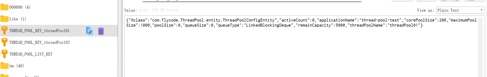

## 动态线程池
由于在日常工作中，线程池的参数配置设置好了，就无法动态更改，只能重启项目，会影响实际业务，所以开发这款动态线程池组件，可以实现引入依赖后，在外部即可控制线程池核心线程数、最大线程数、队列长度。

功能如下：
- 获取线程池基本参数：核心线程数、最大线程数、队列长度、总任务数、剩余任务数
- 使用Redis作为注册中心，数据存储到redis，统一管理
- 使用Redis的发布订阅功能


## 使用方式
1. 将stater项目本地打包
2. 编写yml配置
```yml
dynamic:
  thread:
    pool:
      config:
        database: 0
        port: 6379
        host: localhost
        enable: true 
```

## 引入效果
```
当前应用:thread-pool-test, threadPoolInfo:{"threadPool01":{"activeCount":0,"completedTaskCount":0,"corePoolSize":20,"largestPoolSize":0,"maximumPoolSize":50,"poolSize":0,"queue":[],"rejectedExecutionHandler":{},"shutdown":false,"taskCount":0,"terminated":false,"terminating":false,"threadFactory":{}},"threadPool02":{"activeCount":0,"completedTaskCount":0,"corePoolSize":20,"largestPoolSize":0,"maximumPoolSize":50,"poolSize":0,"queue":[],"rejectedExecutionHandler":{},"shutdown":false,"taskCount":0,"terminated":false,"terminating":false,"threadFactory":{}}}
```
